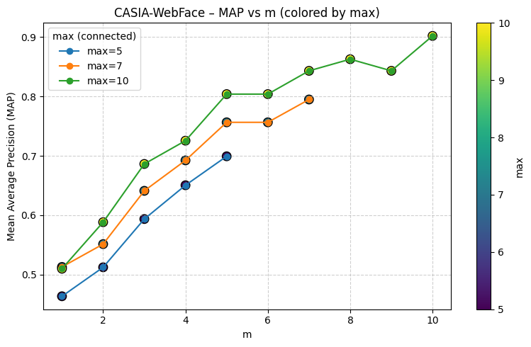
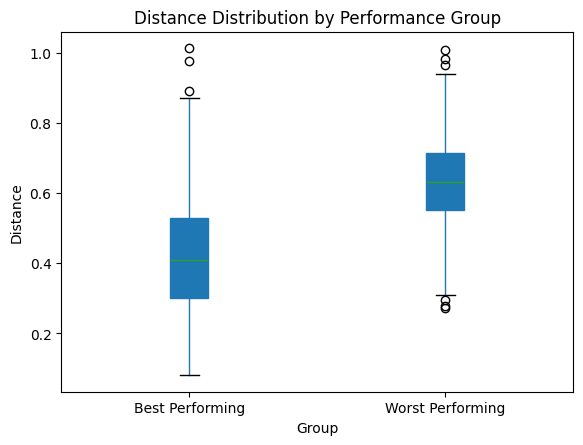

# 1 - Model Performance Comparison
To assess the performance of VGGFace2 and CASIA-WebFace, we compare them using the mAP (Mean Average Precision) metric. This metric is superior as it not only measures whether relevant identities are retrieved, but also incorporates the ranking of those identities—penalizing cases where true matches are pushed further down the list. Unlike plain precision, which treats a correct match at rank 1 the same as one at rank 5, mAP rewards models that consistently place relevant items higher in the ranking. Furthermore, it increases as a greater proportion of all relevant identities are included in the retrieved set, making it a more comprehensive evaluation of retrieval quality.

#### Results
**Table 1.** Comparison of mAP for VGGFace2 and CASIA-WebFace under different environmental noise conditions on the IronClad dataset.

| Condition              | VGGFace2 mAP | CASIA-WebFace mAP |
|------------------------|--------------|-------------------|
| No environmental noise | 0.6463       | 0.3726            |
| Gaussian blur          | 0.5575       | 0.2677            |
| Resizing               | 0.6278       | 0.3678            |
| Brightness adjustment  | 0.5506       | 0.3561            |

Table 1 reports the Mean Average Precision (mAP) for VGGFace2 and CASIA-WebFace across four environmental conditions using a BruteForce nearest neighbor search with Euclidean distance. Across all conditions, VGGFace2 outperforms CASIA-WebFace by approximately 0.2–0.3 mAP. This trend is consistent regardless of whether noise is introduced.

Environmental degradations reduce performance for both models, but the relative gap between the two remains stable. Here is how the different environment noises impact the model.

* **Gaussian blur:** VGGFace2 drops from 0.6463 to 0.5575 (−13.7%) and CASIA-WebFace drops from 0.3726 to 0.2677 (−28.2%). Generally, VGGFace2 is more resilient to this type of noise than CASIA-WebFace.
* **Resizing:** VGGFace2 is minimally affected from 0.6463 to 0.6278 (−2.9%), while CASIA-WebFace also shows a small reduction from 0.3726 to 0.3678 (−1.3%). This means that both models are generally resilient towards this type of noise.
* **Brightness adjustment:** VGGFace degrades substantially, with accuracy falling from 0.6463 to 0.5506 (-14.8%). On the other hand, CASIA-WebFace only degrades slightly, with accuracy falling from 0.3726 to 0.3561 (-4.4%). Generally CASIA-WebFace is more resilient to this type of noise than VGGFace2, although VGGFace2 still beats CASIA-WebFace in raw accuracy.

VGGFace2 achieves higher accuracy under both the baseline condition (no environmental noise) and the more severe noise settings (Gaussian blur, brightness). CASIA-WebFace demonstrates consistently lower mAP values. Therefore, VGGFace2 should be selected.

# 2 - Indexing Selection
To figure out which type of indexing makes the most sense for our production system, we will compare the performance of the different indices. Performance metrics that are considered includes accuracy (mAP), speed (time to add identities and query probes), and memory footprint. 

#### Results
**Table 2.** Comparison of performance on different indexing methods for VGGFace2.

| Performance Metric      | Brute Force | HNSW   | LSH    |
|-------------------------|-------------|--------|--------|
| mAP                     | 0.6463      | 0.5575 | 0.3862 |
| Time Add Identities (s) | 0.0602      | 0.3072 | 0.1590 |
| Mem footprint (GB)      | 0.0043      | 0.0049 | 0.0003 |
| Time Query Probes (s/q) | 0.2522      | 0.1728 | 0.1130 |

Table 2 summarizes the comparative performance of different indexing methods applied to VGGFace2, evaluated under a controlled environment using an Intel Core i5-11600k processor. While the brute force index has the best accuracy and is the quickest to add identities, it has the slowest query times and a large memory footprint. On the other hand, LSH provides the quickest query time and lowest memory footprint at the cost of accuracy and time to add identities. HNSW offers a balance between Brute Force and LSH in terms of accuracy and query speed, but this has the highest indexing time and memory usage.

From the company's requirements, since this is used for security purposes, the accuracy (mAP) should be the highest priority. Any misidentifications could mean that people without authorization can access sensitive information. The second-largest priority is to minimize the time to query probes for scalability. Too much latency means that the workers are just idling while the system processes the information, resulting in lower productivity. We can also assume that the time to change access control (add identities) is a lower priority because changing access control does not happen not often compared to identity searching on a daily basis. Memory footprint is not a concern unless the server has only a few GB of RAM, which is unlikely for a project of this scale. 

The indexing recommendation is simple. For the best accuracy, the brute force indexing method should be used. HNSW indexing method should only be considered if the query latency is too high. LSH is not recommended due to the significantly lower accuracy.

# 3 - Configuring Number of Identities Returned
Let $N$ be the number of identities returned. The accuracy (mAP) and speed (time per query and max queries per second) are assessed to determine the best $N$ across different models and indexing methods.

### VGGFace2 and Brute Force
**Table 3-1.** Comparison of performance on different $N$ values using VGGFace2 and Brute Force Index.

| N | mAP    | Time per Query (s) | Max Queries/s |
|---|--------|--------------------|---------------|
| 1 | 0.7087 | 0.3316             | 3.0161        |
| 2 | 0.6789 | 0.3319             | 3.0128        |
| 3 | 0.6619 | 0.3357             | 2.9793        |
| 4 | 0.6528 | 0.3706             | 2.6986        |
| 5 | 0.6463 | 0.3569             | 2.8017        |
| 6 | 0.6392 | 0.3634             | 2.7520        |

Table 3-1 shows that $N=1$ provides the best performance, achieving the highest accuracy while maintaining nearly identical speed compared to other $N$ values (within a few milliseconds). Because brute force evaluates all indices regardless of $N$, increasing the number of returned identities does not meaningfully affect runtime. Minor speed fluctuations within a few milliseconds are considered within experimental error, as runtime jitter of 1–5 ms is typical on general-purpose systems. Moreover, when $N$ increases, the system generally does not retrieve more relevant identities for failed predictions, so accuracy does not improve.

### VGGFace2 and HNSW
**Table 3-2.** Comparison of performance on different $N$ values using VGGFace2 and HNSW Index.

| N | mAP    | Time per Query (s) | Max Queries/s |
|---|--------|--------------------|---------------|
| 1 | 0.7087 | 0.1659             | 6.0278        |
| 2 | 0.6784 | 0.1678             | 5.9587        |
| 3 | 0.6617 | 0.1672             | 5.9807        |
| 4 | 0.6524 | 0.1723             | 5.8050        |
| 5 | 0.6459 | 0.1718             | 5.8214        |
| 6 | 0.6388 | 0.1727             | 5.7896        |

Table 3-2 shows that $N=1$ outperforms other values of $N$ in terms of both accuracy and speed. This is a similar result found from table 3-1.

### VGGFace2 and LSH
**Table 3-3.** Comparison of performance on different $N$ values using VGGFace2 and LSH Index.

| N | mAP    | Time per Query (s) | Max Queries/s |
|---|--------|--------------------|---------------|
| 1 | 0.4875 | 0.0947             | 10.5600       |
| 2 | 0.4940 | 0.0953             | 10.4949       |
| 3 | 0.4903 | 0.0951             | 10.5118       |
| 4 | 0.4834 | 0.0961             | 10.4013       |
| 5 | 0.4790 | 0.0961             | 10.4018       |
| 6 | 0.4754 | 0.0970             | 10.3104       |

Table 3-3 shows that $N=3$ outperforms other values of $N$ in terms of accuracy while maintaining similar speed (within one millisecond). At this $N$ value, it balances the idea of adding more retrieved matches in the case where the next best match could be correct if the initial match is wrong while ensuring that not too many irrelevant results are added.

### CASIA-WebFace and Brute Force
**Table 3-4.** Comparison of performance on different $N$ values using CASIA-WebFace and Brute Force Index.

| N | mAP    | Time per Query (s) | Max Queries/s |
|---|--------|--------------------|---------------|
| 1 | 0.3624 | 0.1902             | 5.2567        |
| 2 | 0.3774 | 0.1920             | 5.2077        |
| 3 | 0.3732 | 0.1964             | 5.0921        |
| 4 | 0.3697 | 0.1935             | 5.1669        |
| 5 | 0.3687 | 0.1934             | 5.1708        |
| 6 | 0.3651 | 0.1949             | 5.1306        |

Table 3-4 shows that $N=2$ has the best accuracy while maintaining similar speed (within one millisecond).

### CASIA-WebFace and HNSW
**Table 3-5.** Comparison of performance on different $N$ values using CASIA-WebFace and HNSW Index.

| N | mAP    | Time per Query (s) | Max Queries/s |
|---|--------|--------------------|---------------|
| 1 | 0.3624 | 0.1796             | 5.5679        |
| 2 | 0.3774 | 0.1827             | 5.4734        |
| 3 | 0.3732 | 0.1829             | 5.4670        |
| 4 | 0.3697 | 0.1829             | 5.4664        |
| 5 | 0.3687 | 0.1844             | 5.4216        |
| 6 | 0.3651 | 0.1818             | 5.4998        |

Table 3-5 shows that $N=2$ has the best accuracy while maintaining similar speed (within one millisecond).

### CASIA-WebFace and LSH
**Table 3-6.** Comparison of performance on different $N$ values using CASIA-WebFace and LSH Index.

| N | mAP    | Time per Query (s) | Max Queries/s |
|---|--------|--------------------|---------------|
| 1 | 0.1211 | 0.0981             | 10.1894       |
| 2 | 0.1421 | 0.0940             | 10.6393       |
| 3 | 0.1481 | 0.0919             | 10.8850       |
| 4 | 0.1532 | 0.0949             | 10.5355       |
| 5 | 0.1548 | 0.0961             | 10.4065       |
| 6 | 0.1564 | 0.0967             | 10.3460       |

Table 3-6 shows that $N=6$ results in the best accuracy while maintaining similar speed (within one millisecond).

### Analysis

Across Tables 3-1 to 3-6, a clear pattern emerges. CASIA-WebFace benefits from returning approximately twice as many identities compared to VGGFace2. This difference arises because VGGFace2 embeddings are more discriminative (its nearest neighbor is usually the correct identity) whereas CASIA-WebFace’s embeddings are less separable, so including the second-closest match improves the chance of capturing the correct identity within the candidate set.

When comparing indexing methods, both Brute Force and HNSW achieve similar accuracy–latency tradeoffs, yielding the same optimal $N$ within each model. However, the LSH index requires a larger $N$ (three times higher) to compensate for its approximate search nature and lower retrieval precision. In practice, this means setting $N = 1$ for VGGFace2 (Brute Force or HNSW) and $N = 2$ for CASIA-WebFace (Brute Force or HNSW). When using LSH indexing, $N$ is tripled. These choices balance retrieval accuracy and query efficiency given the probe–gallery characteristics of the provided dataset.

# 4 - Optimizing Number Images in Gallery
Let $m$ represent the number of images each individual has in the gallery. To determine the optimal $m$, we compared performance (mAP) across different $m$ values. To ensure a fair and controlled experiment, we included only individuals with at least $n$ images, where $m \leq n$, so that variations in accuracy were not caused by adding more individuals. To also account for those with fewer images, we repeated this experiment for multiple values of $n$. We also control the indexing method (Brute Force) and the number of relevant results returned ($N = 1$ as this is the optimal value found in section 3).

### VGGFace

**Figure 4-1.** Comparison of MAP on different values of $m$ where each line represents a subset of identities that has at least $n$ photos in the gallery.

From Figure 4-1, the optimal $m$ appears to be approximately 3 to 5. This is determined by identifying the “kink” in the mAP curve, where the marginal gains in performance diminish to nearly zero. This range represents a good tradeoff—large enough to provide multiple examples for each identity, but not so high that it introduces unnecessary redundancy or computational overhead. The presence of multiple examples provides greater variation in pose, lighting, and expression, allowing the model to build a more robust representation and find visually similar identities more effectively.

Interestingly, $m = 3$ or $m = 4$ works best for individuals who already have many images (7 to 10) in the gallery, while $m = 5$ performs better for those with fewer images (less than 7). This suggests that individuals with more images are more easily recognized by the system. A possible reason for this is that these individuals are likely more prominent or well-known, increasing the likelihood that the model encountered them during training.

### CASIA-WebFace

**Figure 4-2.** Comparison of MAP on different values of $m$ where each line represents a subset of identities that has at least $n$ photos in the gallery.

From Figure 4-2, overall the optimal $m$ seems to be as high as possible ($m = 10$). In all cases, increasing $m$ led to higher accuracy gain. Diminishing returns starts to be noticeable after $m = 5$, but there is still significant gain to be had for increasing $m$. For example, increasing $m$ from 5 to 10 for those with 10 images seen an mAP increase of approximately $0.1$.

# 5 - Uncertainty Estimation

### Behavior in Image Space
**Table 5-1.** The effect of image characteristic differences on the mAP. These results were obtained from manual inspection of images with the lowest and highest mAPs.

| Name                | Large Brightness / Contrast Difference | Pose / Expression Variation | Unique Face Shape? | mAP  |
|---------------------|----------------------------------------|-----------------------------|--------------------|------|
| Inam-ul-Haq         | Y                                      | Y                           | N                  | Low  |
| Mark Cuban          | Y                                      | Y                           | N                  | Low  |
| Carl Reiner         | Y                                      | N                           | N                  | Low  |
| Demetrius Ferraciu  | N                                      | Y                           | N                  | Low  |
| Max Mayfield        | Y                                      | Y                           | N                  | Low  |
| Bobby Goldwater     | N                                      | N                           | N                  | High |
| Yoko Ono            | N                                      | N                           | N                  | High |
| Slobodan Milosevic  | N                                      | N                           | N                  | High |
| Saeb Erekat         | M                                      | M                           | Y                  | High |
| Richard Branson     | M                                      | M                           | Y                  | High |

### Behavior in Embedding Space
**Table 5-2.** The effect of mAP (lowest or highest performing) on the distance to predicted target.

### Strategy to Improve Performance

TODO